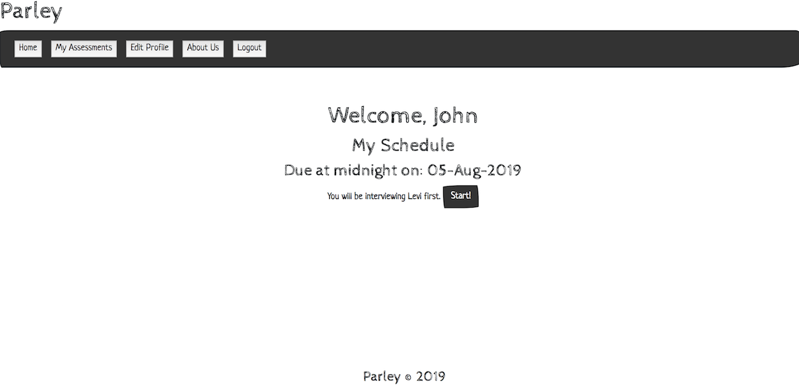
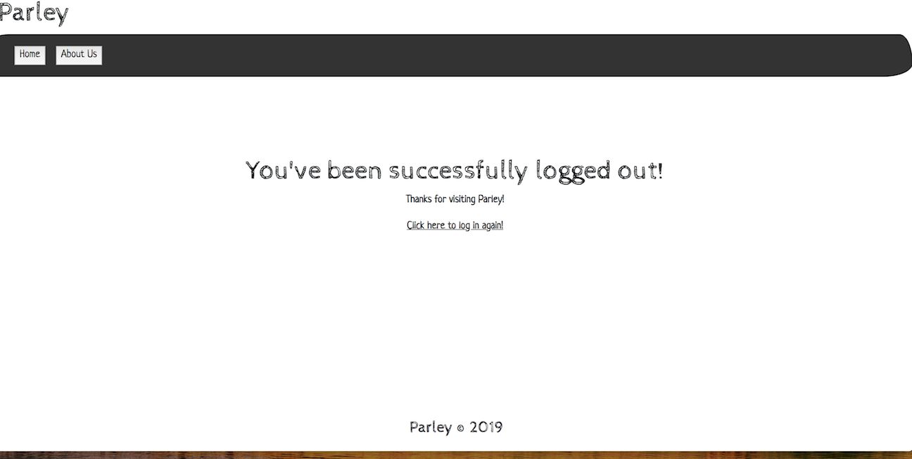

# [Parley App](http://www.techparley.com/)
They Parley app allows code school userAccounts to easily set up and administer whiteboard technical challenges to their students.  Students are able to log in and use a visual interface to interview and grade other students.

- Instructors can:  
    - Add/remove students to a class list (Coming Soon)
    - Add/remove technical prompts from prompt list
    - View a list of scheduled interviews by day/week/month (Coming Soon)
    - Schedule student pairs for whiteboard interviews
    - Generate randomized whiteboard pairs and questions from a class list (Coming Soon)
- Students can: 
    - See their scheduled interviews
    - Start an interview session
    - Grade the interview using the visual interface - scores and comments
    - Submit the final interview grade
    - Download interview results as a document file


An architecture and/or data-flow drawing (preferably in UML) that illustrates how your application works.  


  
    
  
  
  
  
  

  

  

  
  
  

## Thanks to - 
https://css-tricks.com/snippets/css/a-guide-to-flexbox/
https://www.w3schools.com/css/tryit.asp?filename=trycss_image_text_center2
https://stackoverflow.com/questions/15000239/2-style-inline-css-img-tags
https://stackoverflow.com/questions/2744690/preventing-fixed-footer-from-overlapping-content
https://css-tricks.com/couple-takes-sticky-footer/
https://stackoverflow.com/questions/12381563/how-to-stop-browser-back-button-using-javascript

# Technologies 
- [Spring](https://spring.io/)
- [Thymeleaf](https://www.thymeleaf.org/)
- [AWS RDS](https://aws.amazon.com/rds/)
- [AWS CodePipeline](https://aws.amazon.com/codepipeline/)
- [AWS EC2](https://aws.amazon.com/ec2/)
- [AWS S3](https://aws.amazon.com/s3/)
- [AWS Elastic Beanstalk](https://aws.amazon.com/elasticbeanstalk/)

## Purpose 
The purpose of this website is to avoid the problems associated with taking mock whiteboard interviews
in an academic setting. Users are able to register for the site in order to use it. Those with admin rights
are able to create a interview event between two students. Those two students (when they are interviewers) 
will each be assigned a prompt to ask the interviewee. Admins can also add prompts to the database as well as 
delete prompts if they deem necessary. Users can also view the due date of the interview.

# How to use Parley
Directions to run the application, both for local development and in production
these should be very detailed!

## Directions to Clone and Run Locally
+ CD into the desired directory on your local machine and clone the repo by typing the following in your terminal:
```
 $ git clone https://github.com/stephenchu530/parley-app
```

+ Link for cloning the repo can be found from [Parley Repo](https://github.com/stephenchu530/parley-app)
+ Set up the parley databases locally.
    + In the terminal: ``$ psql``
    + You may need to type your password
    + Then in the terminal: ``$ CREATE DATABASE parley;``
    + The tables will be created according to the following schema:  
     
+ Open the code on your desired IDE.
+ If using ItelliJ IDEA, this is found in the PotluckPlannerApplication dropdown and clicking Edit Configurations, then 
Environment variables: field.
+ If you are not using a Mac, then you will likely need your postgres username and password. 
    + These can also be entered in under environment variables. In the case of this application, 
    we used POSTGRES_USERNAME and POSTGRES_PASSWORD in the application.properties file
+ Run the application 
    + In the terminal this is done by typing the following command:
    ``
    $ ./gradlew bootRun
    ``

## Routes/API
+ @GetMapping("/home")
    + The home page for the site
+ @GetMapping("/")
    + Redirect the user to the home page
+ @GetMapping("/register")
    + The page where a user can register as a Parley user  
+ @GetMapping("/login")
    + The page for registered users to login  
+ @GetMapping("/logout_complete")
    + The page where user are redirected once successfully logged out
+ @GetMapping("/aboutus")
    + The page dedicated to the developers of Parley
+  @GetMapping("/makeAdmin")
    + The page where someone who is already an admin can give another user admin rights
+ @GetMapping("/myprofile")
    + The page that shows all of the interviews the logged in user is scheduled for as well as the ones they have already taken
+ @GetMapping("/evaluation/{interviewId}")
    + Upon beginning a mock interview, will bring up the evaluation form specific to the student.
+ @GetMapping("/schedule")
    + Shows all of the upcoming interviews for a student
+ @GetMapping("/toFile/{id}")
    + The page where the user see a copy of an assessment they have already taken
+  @GetMapping("/myassessments")
    + Shows all of the assessments for the interviews a student has taken
+ @GetMapping("/prompt")
    + The page where an admin can add or delete a prompt
+ @GetMapping("/editprofile")
    + The page where a user can edit their profile (coming soon)
+ @GetMapping("/addstudent")
    + An admin can add a student to a class
+ @GetMapping("/addclass")
    + An admin can create a new class
+ @PostMapping("/prompt")
    + An admin can add a prompt to be pulled from for future interviews
+ @PostMapping("/assessments/{idString}")
    + Upon submission of an evaluation, it will be turned into an assessment object
+ @PostMapping("/scheduleinterview")
    + Scheduling an interview for a student - for instructors only.  
+ @PostMapping("/register")
    + Puts the user information in the database so they can login later
+ @PostMapping("/makeAdmin")
    + Gives a designated user admin rights - admins only.
+ @PostMapping("/delete/prompt")
    + An admin can choose a prompt to be deleted from the database

## Planning
+ [User Stories](docs/UserStories.md)
+ [Wire Frame](docs/wireframe001.jpg)
+ [Team Agreement](docs/TeamAgreement.md)

# Our Team
[Luke Chandler](https://github.com/lhchandler4)  
[Will Fritts](https://github.com/wafman)  
[Stephen Chu](https://github.com/stephenchu530)  
[Rob Bronson](https://github.com/rjbrons)  

## License
> This project is licensed under the MIT License - see the [License](https://choosealicense.com/licenses/mit/) file for details.